# StreamNet Debrid

StreamNet Debrid is a StreamNet-focused Android TV APK with its own cloud/auth backend.

This repository intentionally keeps only the surfaces that are needed for the app runtime and account sync:

- `app/` - Android TV/mobile APK source
- `self-hosted-backend/` - StreamNet account, sync, pairing, deletion, analytics, and hosted auth/privacy pages

Removed/omitted surfaces include the upstream marketing site, browser web app, resolver worker, benchmark module, and release artifact folders.

## Screenshots

### Mobile

| Home                                                                          | Live TV                                                                       |
| ----------------------------------------------------------------------------- | ----------------------------------------------------------------------------- |
| 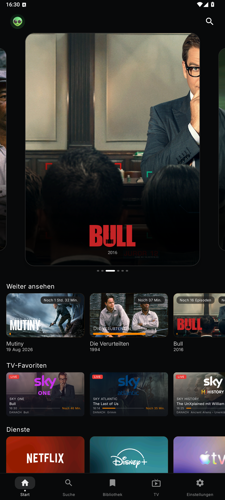           | 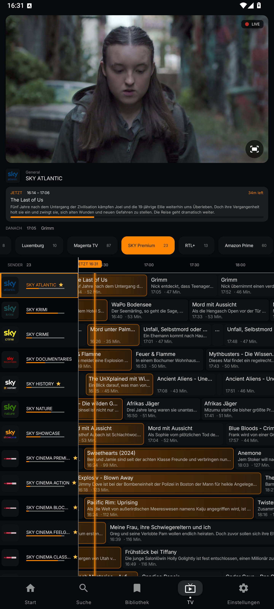        |
| Profiles                                                                      | IPTV VOD                                                                      |
| 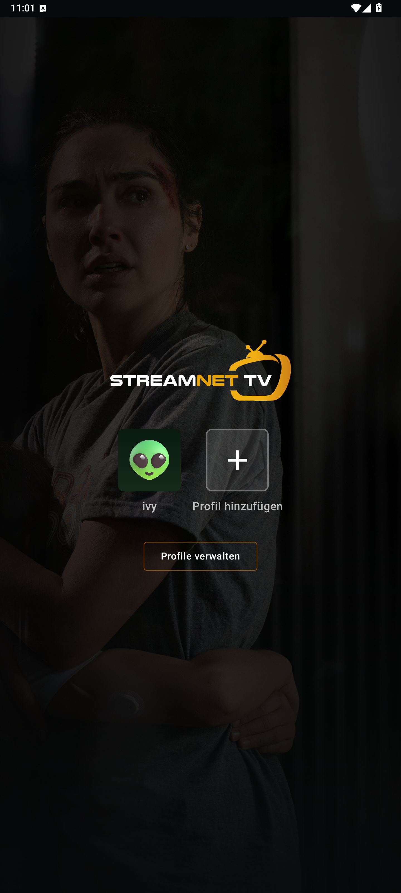 | 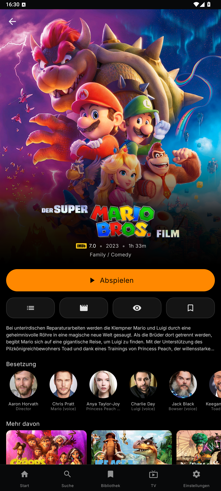 |

### Tablet

| Home                                                                   | Home catalog                                                                 |
| ---------------------------------------------------------------------- | ---------------------------------------------------------------------------- |
| 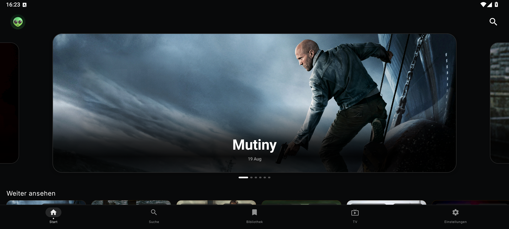    | 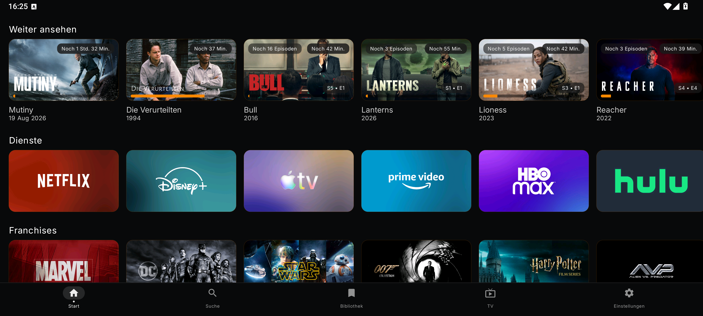        |
| Live TV                                                                | Profiles                                                                     |
| 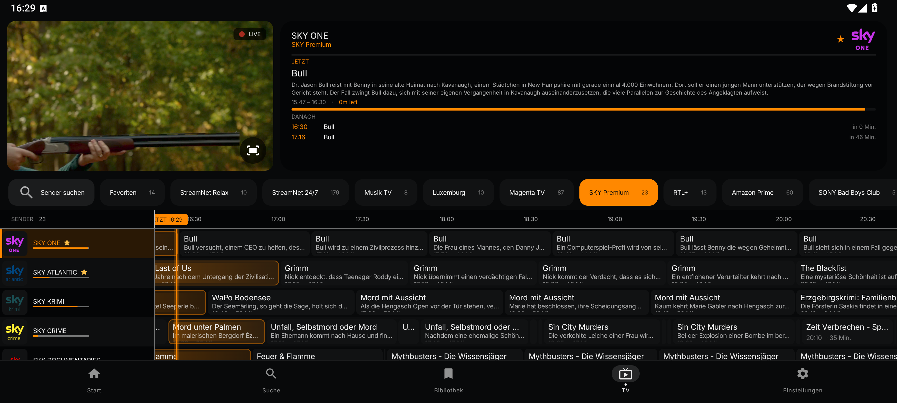 | 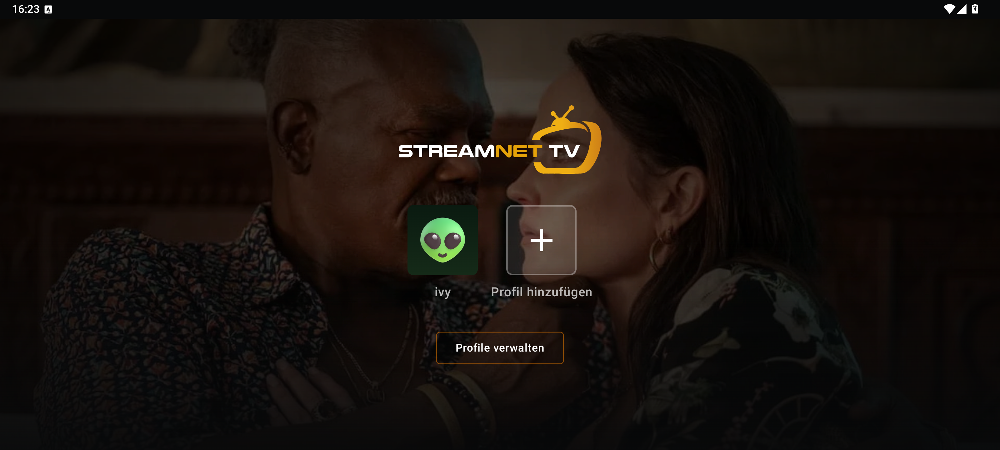 |
| IPTV VOD                                                               |                                                                              |
| 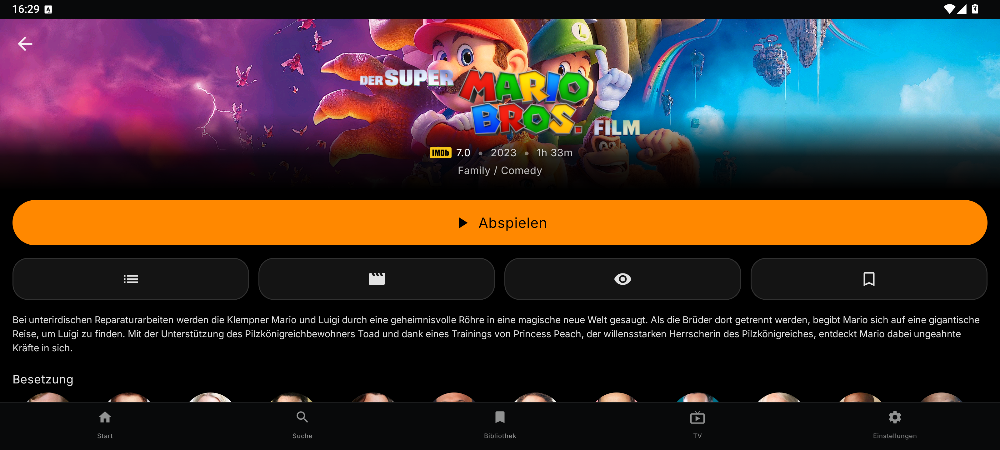 |                                                                              |

### TV

| Home                                                          | Live TV                                                  |
| ------------------------------------------------------------- | -------------------------------------------------------- |
| 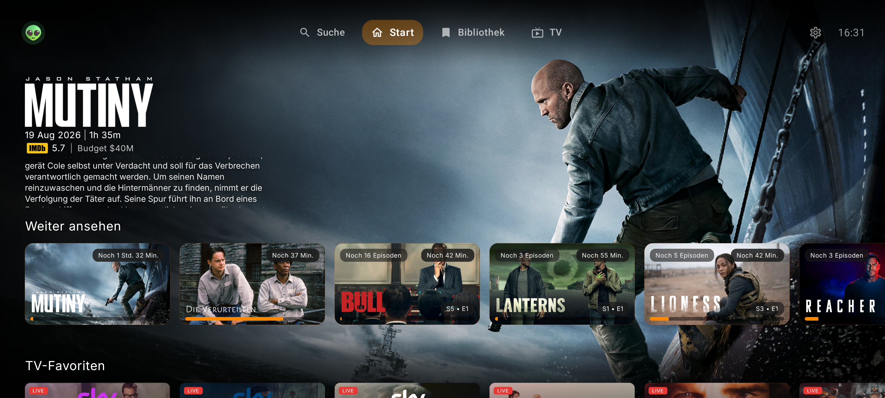          | 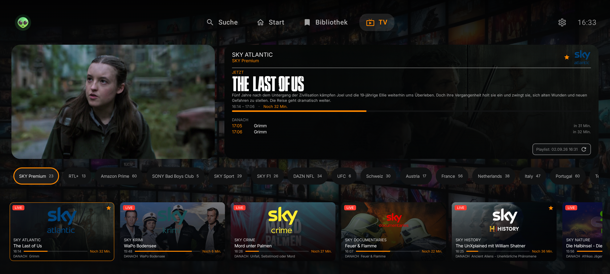  |
| Profiles                                                      | IPTV VOD                                                 |
|  | 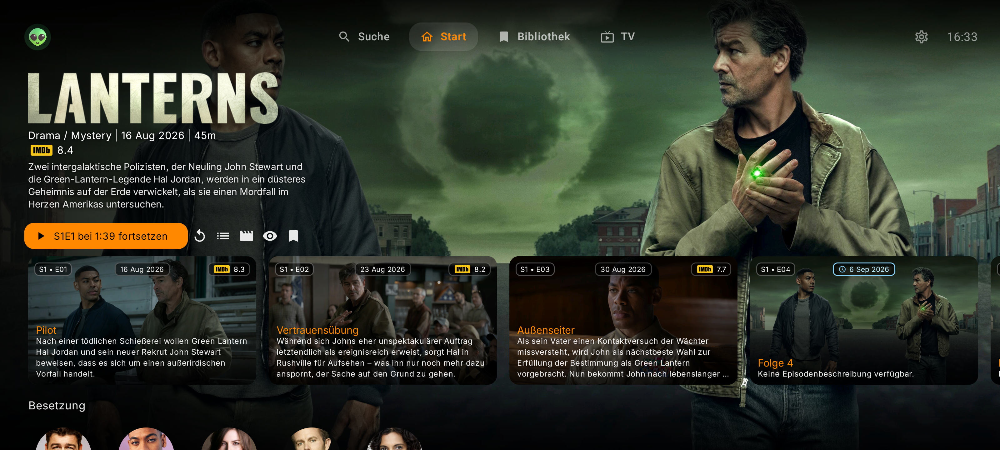 |
| IPTV VOD details                                              |                                                          |
| 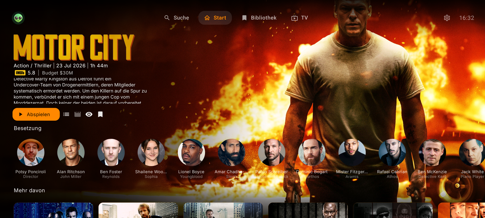     |                                                          |

## Cloud Migration Status

The production Android release uses the self-hosted backend at `https://auth.mystreamnet.club`. PostgreSQL is the canonical store for accounts and sync data.

The verified migration imported 10 Netlify accounts and 5 total self-hosted snapshots, including multi-profile data. A consistency check found 5 snapshots with 0 orphaned account references. Login, cloud sync, TV pairing, and the bilingual success page were tested before the production endpoint change.

Migration exports contain sensitive account records and must remain outside Git. Existing access and refresh sessions were intentionally not migrated; users sign in again after installing the production build.

## Android Build

Copy local secrets and fill real values:

```bash
cp secrets.defaults.properties secrets.properties
```

Set `STREAMNET_TV_XTREAM_URL` to the Xtream server base URL to include the fixed StreamNet TV preset. The host is hidden in the playlist settings; each user enters their own username and password when activating it. Because the host is embedded in the APK, treat it as configuration rather than a confidential server-side secret.

Build a sideload debug APK:

```bash
./gradlew :app:assembleSideloadDebug
```

APK builds include 32-bit and 64-bit ARM by default. For an x86/x86_64 emulator,
add `-PincludeX86Abis=true` to the Gradle command.

Useful validation:

```bash
./gradlew :app:compileSideloadDebugKotlin
```

The debug APK is written to:

```text
app/build/outputs/apk/sideload/debug/app-sideload-debug.apk
```

## Discord Partner SDK

Discord Rich Presence is optional and requires Discord's separately licensed Android Partner SDK.
For local builds, place the approved AAR at:

```text
app/libs/discord_partner_sdk.aar
```

Then set this in `secrets.properties`:

```properties
DISCORD_CLIENT_ID=<your Discord application id>
```

Do not commit or redistribute the AAR unless your Discord SDK agreement explicitly permits it.
Signed GitHub Actions builds download the AAR from `DISCORD_PARTNER_SDK_URL`. For private GitHub release assets, also set `DISCORD_PARTNER_SDK_BEARER_TOKEN`. `DISCORD_PARTNER_SDK_AAR_SHA256` is optional but recommended.

## CI Secrets

The signed Android release workflow creates a temporary `secrets.properties` file from GitHub Actions encrypted secrets. Values are available only during the build and are not committed. All variants use `CLOUD_BACKEND_URL`; production sets it to `https://auth.mystreamnet.club`.

The workflow expects these repository secrets as needed:

- `TMDB_API_KEY`
- `TRAKT_CLIENT_ID`
- `TRAKT_CLIENT_SECRET`
- `KEYSTORE_BASE64`
- `KEYSTORE_PASSWORD`
- `KEY_ALIAS`
- `KEY_PASSWORD`
- `DISCORD_CLIENT_ID`
- `DISCORD_PARTNER_SDK_URL`
- `DISCORD_PARTNER_SDK_BEARER_TOKEN` (if the SDK URL is private)
- `DISCORD_PARTNER_SDK_AAR_SHA256` (optional integrity check)
- `STREAMNET_TV_XTREAM_URL`

The local `secrets.properties` file is ignored by Git and should be used for local builds only. Do not upload it or put private API credentials into source code. Values that must be embedded in an APK should be treated as public, because APK users can extract them; keep signing passwords, SDK download tokens, and server-side secrets only in GitHub Actions secrets or the backend environment.
