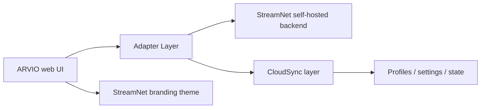

# Upstream Webplayer Integration Blueprint

## Summary

We reviewed the upstream ARVIO project documentation and the repository positioning. The upstream app is a browser-capable media frontend with self-hosting support, but this StreamNet fork intentionally drops the browser web surface and keeps only the Android APK and self-hosted backend.

This means the likely integration path is not a blind code port, but a deliberate adapter layer that keeps:

- upstream player + screen behavior
- StreamNet branding
- the StreamNet self-hosted backend as the source of truth
- the existing CloudSync contract as the canonical sync layer

## Upstream observations

From the upstream README and repo docs:

- ARVIO is primarily an Android media hub with a browser web build available as a separate web app surface.
- Self-hosting is supported for the web app with a dedicated Node/Docker setup and environment config.
- The app already has concepts like profiles, watch state, Cloud Sync, IPTV, and per-user settings.
- The upstream project is designed around a shared media browser + player model, not a standalone browser-only product.

This aligns well with the StreamNet fork, because the fork already contains the core domain model and backend sync behavior.

## Recommended approach for StreamNet

### Keep this as the integration model

### Why this architecture

- the web frontend stays close to upstream UX and controls
- branding is isolated and easy to swap
- the backend remains the real account + sync source
- the app API contract is normalized instead of depending on upstream field names

## Problem areas to expect

### 1. Branding

The UI appears to be upstream-styled by default. This is mostly a theme layer problem:

- colors
- accent styling
- logos and loading screens
- button and modal styling
- player overlay treatment
- selected/focused states

### 2. Backend contract

The upstream web app and the StreamNet backend will not necessarily share the same routes, tokens, or response shapes.

Expected work:

- auth mapping
- profile response normalization
- media metadata mapping
- watch state + continue-watching normalization
- source / stream resolution adapter

### 3. CloudSync contract

The StreamNet fork already defines a stricter sync model for account snapshots and profile-level data. The web layer must not bypass it.

Expected work:

- profile ID mapping
- local vs cloud merge rules
- profile-scoped settings sync
- watch state synchronization
- no double-write or stale-overwrite bugs

## Implementation plan

### Phase 1: adapter contracts

Define a service boundary that hides the upstream player API from the app logic:

- auth service
- profile service
- media details service
- stream source service
- watch state service
- sync service

### Phase 2: theme layer

Create a StreamNet brand package with:

- colors
- typography
- spacing
- focus states
- loader and logo assets
- player overlays and controls

### Phase 3: backend bridge

Add a configurable backend adapter so the web UI reads from the StreamNet backend instead of the upstream default environment.

### Phase 4: CloudSync bridge

Keep cloud state management centralized and ensure every profile setting is synced under the StreamNet rules.

### Phase 5: sanity passes

Test:

- login/logout
- profile switching
- media details
- source selection
- playback start and resume
- watch history updates
- cloud push/pull behavior

## Initial technical direction

The most realistic path is to treat the ARVIO upstream web build as a UX reference, not as a hard dependency. The webplayer integration should be implemented as a thin integration layer that maps upstream UI expectations to StreamNet backend contracts.

This keeps the project aligned with the fork’s design decisions while still allowing us to borrow the upstream web experience and player polish.

## Immediate next action

We will start by creating the adapter and branding skeleton for this integration in a dedicated implementation folder inside the repo. This will serve as the starting point for later full integration work.
